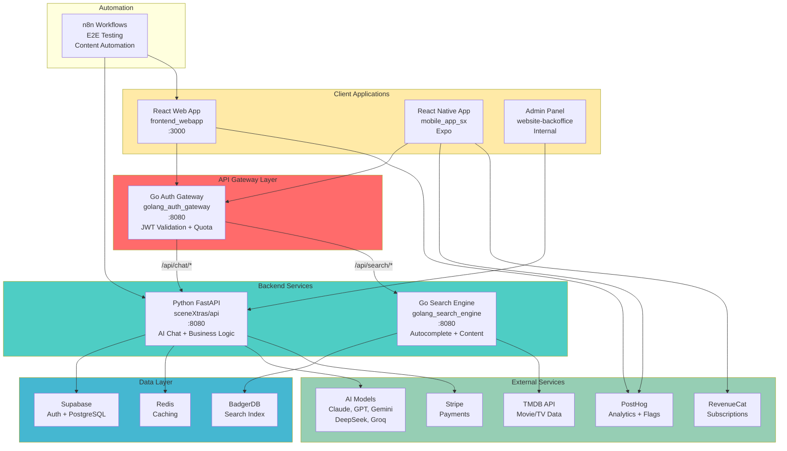
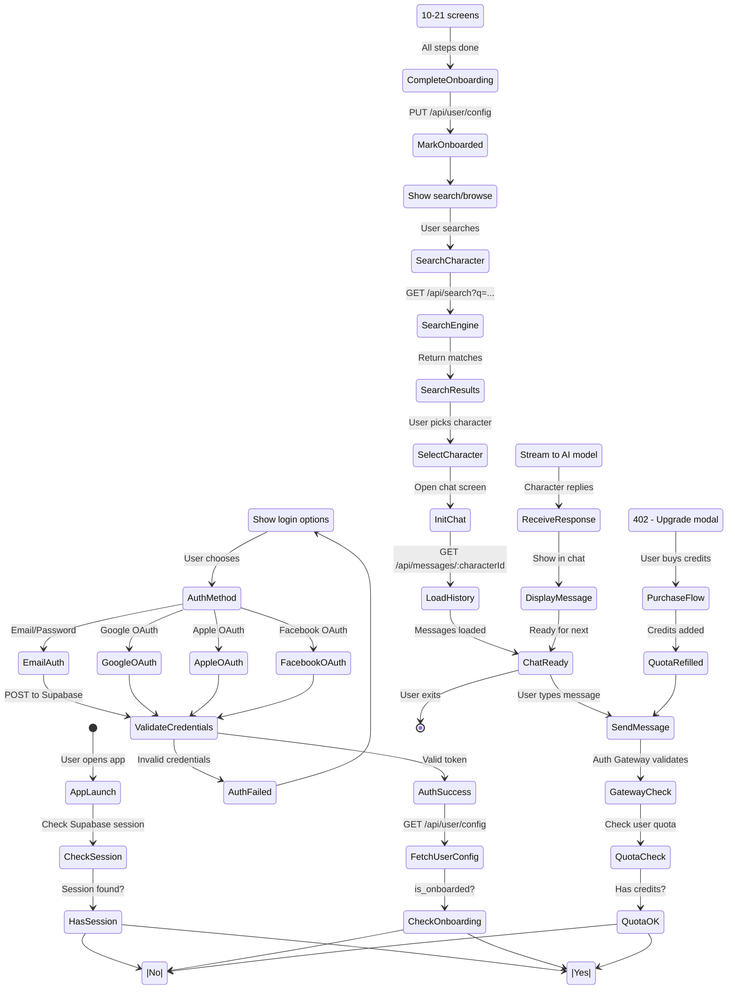
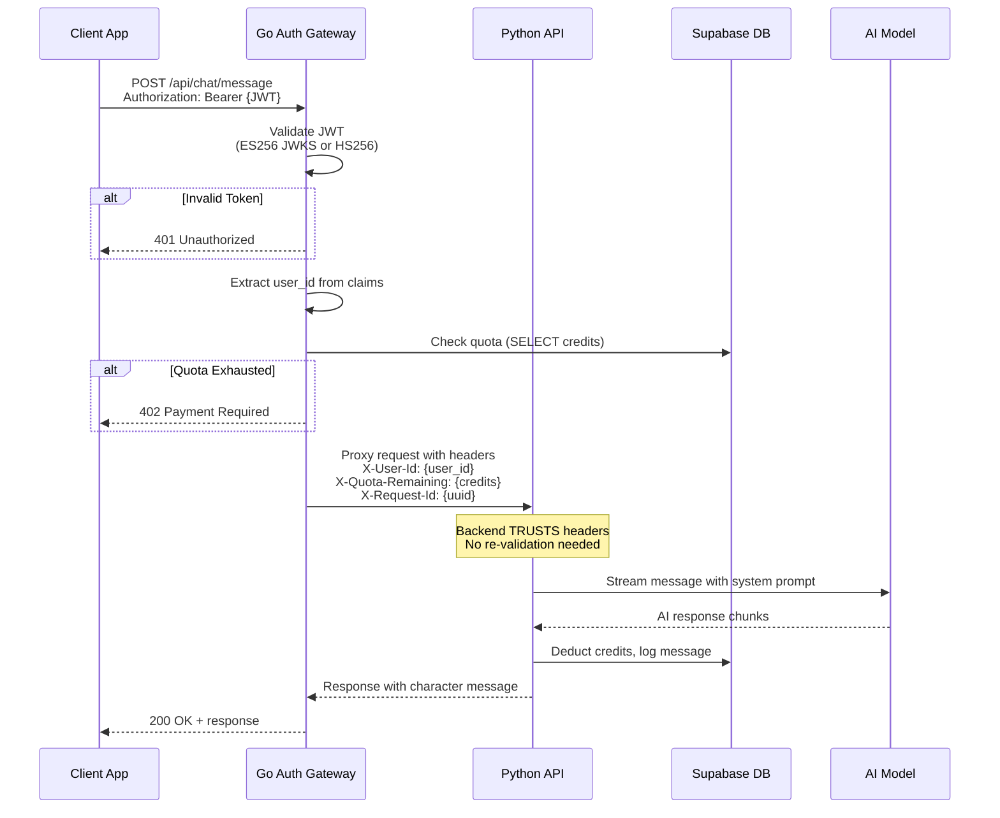
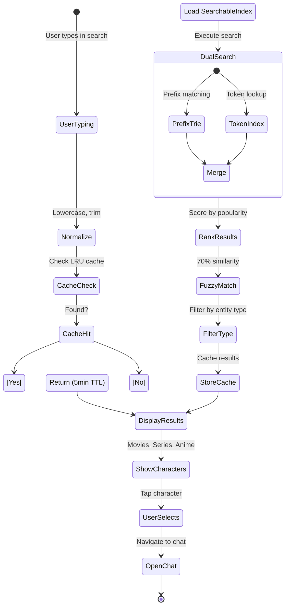
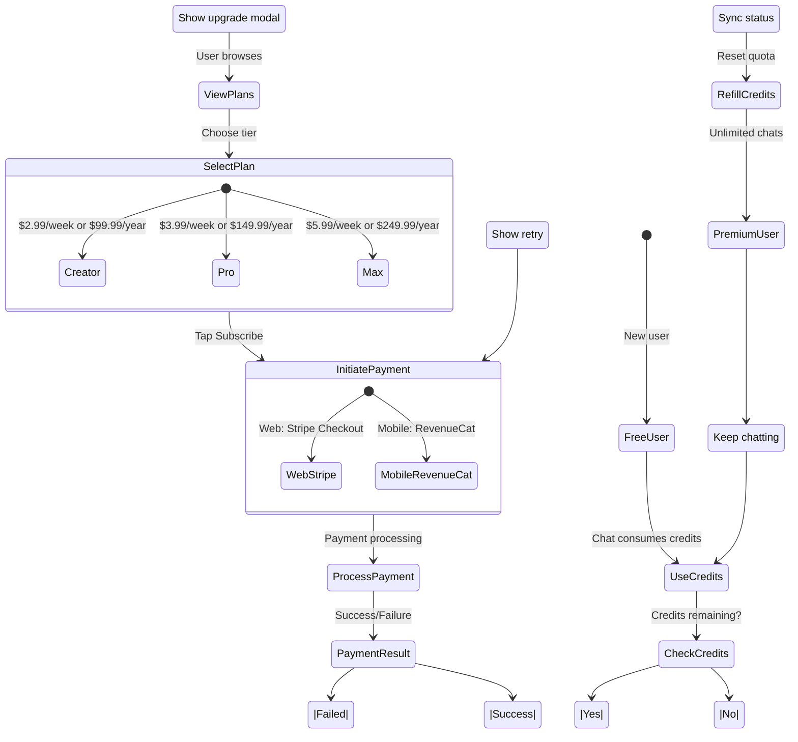
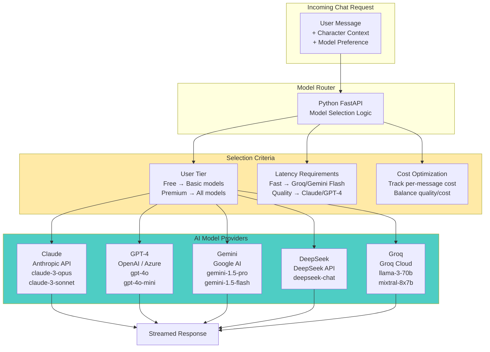
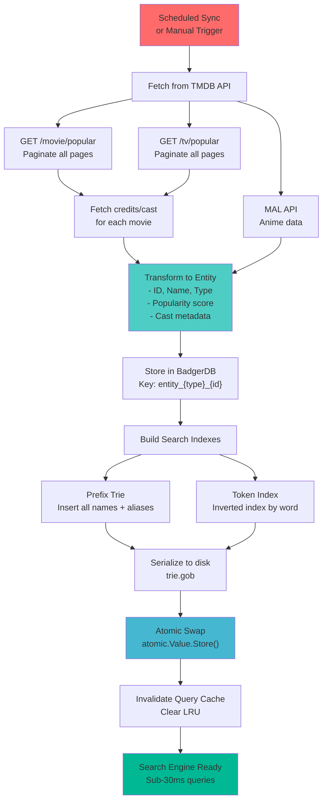
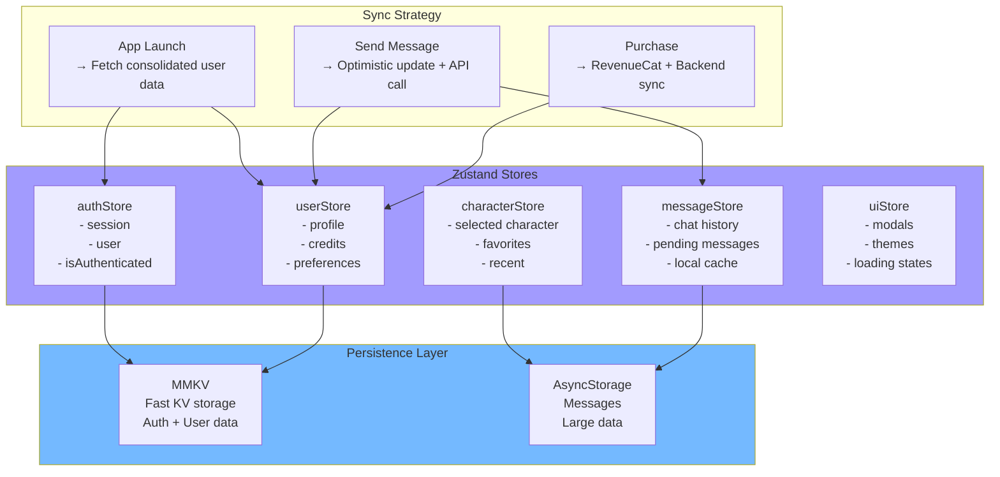
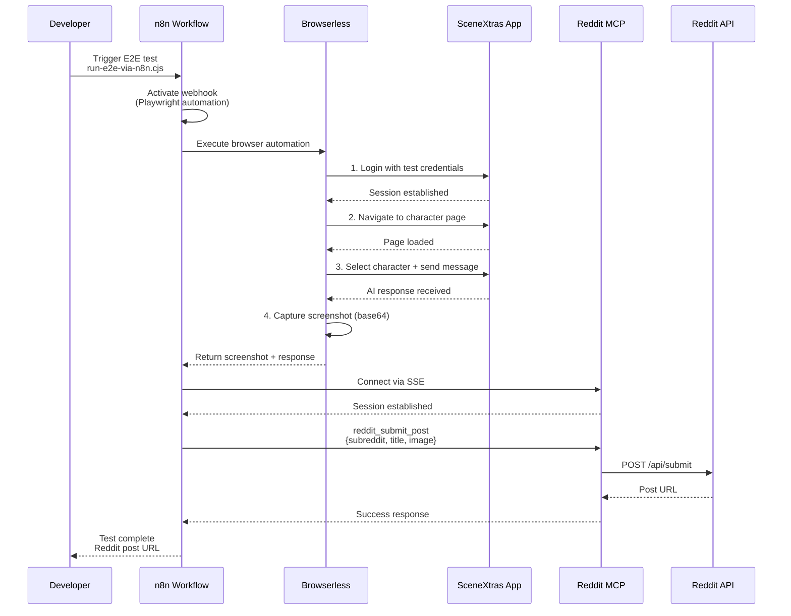
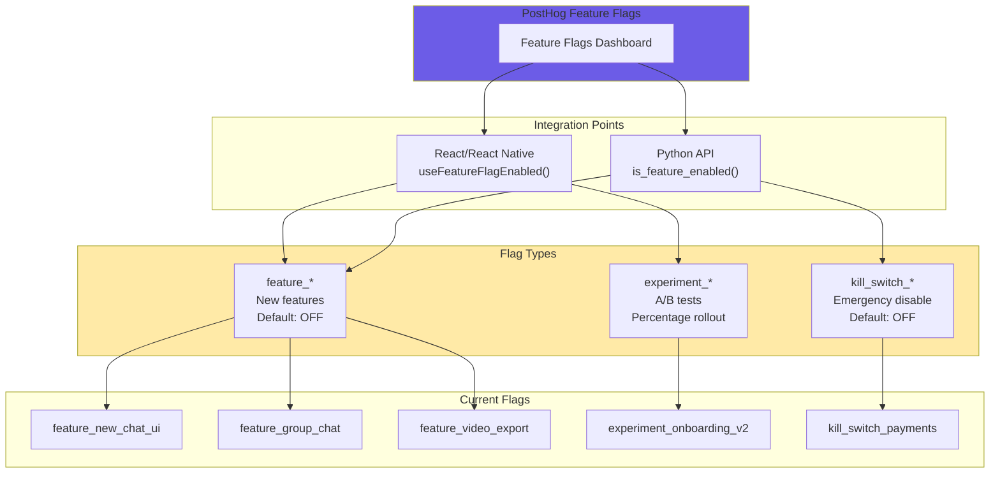

# SceneXtras System Architecture - Business Flow Diagrams

This document provides a comprehensive view of the SceneXtras ecosystem, showing how all services interact to deliver the core product: AI-powered character conversations.

**Generated**: January 14, 2026

---

## 1. System Overview - All Services

---

## 2. User Journey - From Launch to First Chat

---

## 3. High-Trust Security Model - Request Flow

---

## 4. Search Engine Flow - Character Discovery

---

## 5. Payment & Subscription Flow

---

## 6. Multi-Model AI Chat Architecture

---

## 7. Data Sync Pipeline - TMDB to Search

---

## 8. Mobile App State Management

---

## 9. E2E Testing & Automation Flow

---

## 10. Feature Flag Architecture

---

## Service Communication Matrix

| Source | Destination | Protocol | Purpose |
|--------|-------------|----------|---------|
| Web App | Auth Gateway | HTTPS | All API requests |
| Mobile App | Auth Gateway | HTTPS | All API requests |
| Auth Gateway | Python API | HTTP | Chat, user operations |
| Auth Gateway | Go Search | HTTP | Search queries |
| Python API | Supabase | PostgreSQL | User data, messages |
| Python API | Redis | Redis Protocol | Caching |
| Python API | LLM APIs | HTTPS | AI responses |
| Go Search | BadgerDB | Embedded | Search index |
| Go Search | TMDB | HTTPS | Content sync |
| Mobile App | RevenueCat | SDK | Subscriptions |
| All Apps | PostHog | HTTPS | Analytics + Flags |
| n8n | All Services | HTTP/WS | E2E Testing |

---

## Port Assignments

| Service | Port | Environment |
|---------|------|-------------|
| Auth Gateway | 8080 | Production proxy |
| Python API | 8080 | Internal |
| Go Search | 8080 | Internal |
| Web App | 3000 | Development |
| n8n | 5678 | Automation |
| Redis | 6379 | Cache |
| PostgreSQL | 5432 | Database |

---

## Key Architecture Decisions

1. **High-Trust Security Model**: Gateway validates once, backends trust injected headers
2. **Multi-Model AI**: Route to different LLMs based on tier, latency, cost
3. **Dual Search Strategy**: Prefix Trie + Token Index for sub-30ms queries
4. **Atomic Index Updates**: Zero-downtime search index swaps
5. **Quota at Gateway**: Check credits before proxying to prevent abuse
6. **Feature Flags Everywhere**: All new features wrapped in PostHog flags
7. **Mobile-First State**: MMKV for fast persistence, Zustand for state management
8. **E2E Automation**: n8n orchestrates browser automation + social posting

---

## Repository Links

| Repository | Purpose | Key Files |
|------------|---------|-----------|
| `sceneXtras/api` | Python FastAPI backend | `CLAUDE.md`, `Makefile` |
| `frontend_webapp` | React web application | `CLAUDE.md`, `package.json` |
| `golang_search_engine` | Go search service | `CLAUDE.md`, `API_DOCUMENTATION.md` |
| `golang_auth_gateway` | Go auth gateway | `CLAUDE.md`, `TESTING.md` |
| `mobile_app_sx` | React Native mobile | `CLAUDE.md`, `ONBOARDING_SETUP.md` |
| `website-backoffice` | Admin panel | `src/pages/` |
| `automations` | E2E testing, n8n | `run-e2e-via-n8n.cjs` |

---

## Document Index

Each repository contains detailed business flow diagrams:

- `golang_auth_gateway/docs/BUSINESS_FLOWS.md` - Auth, routing, quota flows
- `golang_search_engine/docs/BUSINESS_FLOWS.md` - Search, caching, sync flows
- `frontend_webapp/docs/BUSINESS_FLOWS.md` - User journeys, payment, onboarding
- `mobile_app_sx/docs/BUSINESS_FLOWS.md` - Mobile app flows, subscriptions
- `website-backoffice/docs/BUSINESS_FLOWS.md` - Admin operations
- `automations/docs/BUSINESS_FLOWS.md` - E2E testing, n8n workflows

---

**Status**: Complete
**Last Updated**: January 14, 2026
