# Chat Business Flows & Quota System

This document explains the business logic behind chat quotas, user tiers, and monetization in SceneXtras.

---

## Master Overview: Complete Chat Business Flow

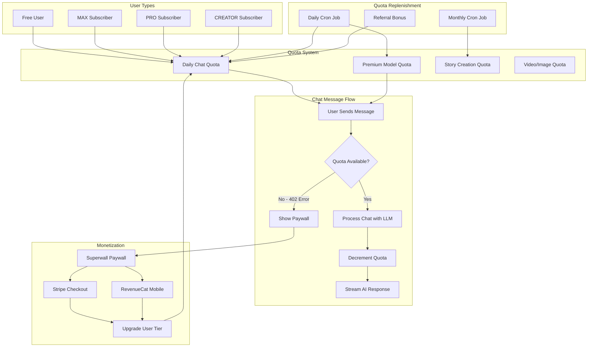

---

## 1. User Tier Hierarchy

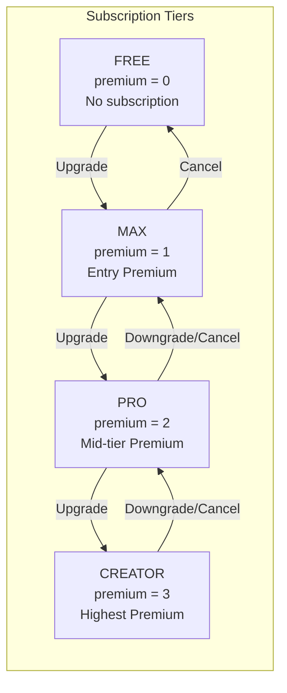

### Tier Benefits Summary

| Feature | FREE | MAX | PRO | CREATOR |
|---------|------|-----|-----|---------|
| Daily Chat Quota | 60 | Unlimited | Unlimited | Unlimited |
| Premium Models/month | 5 | 50 | 300 | 10,000 |
| Stories/month | 1 | 10 | 20 | 100 |
| Video/Image per week | 2 | 10 | 10 | 10 |
| Priority Queue | No | No | Yes | Yes |
| API Access | No | No | No | Yes |

---

## 2. Quota Types & Limits

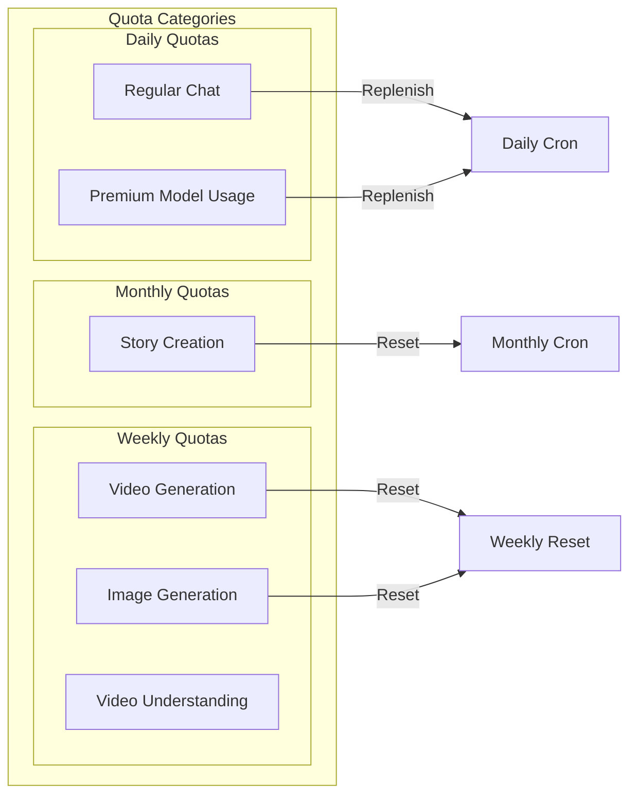

### Quota Limits by Tier

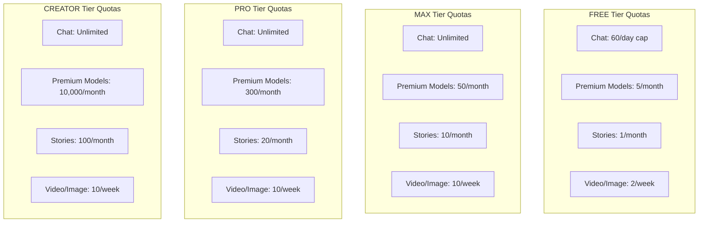

---

## 3. Quota Consumption Flow

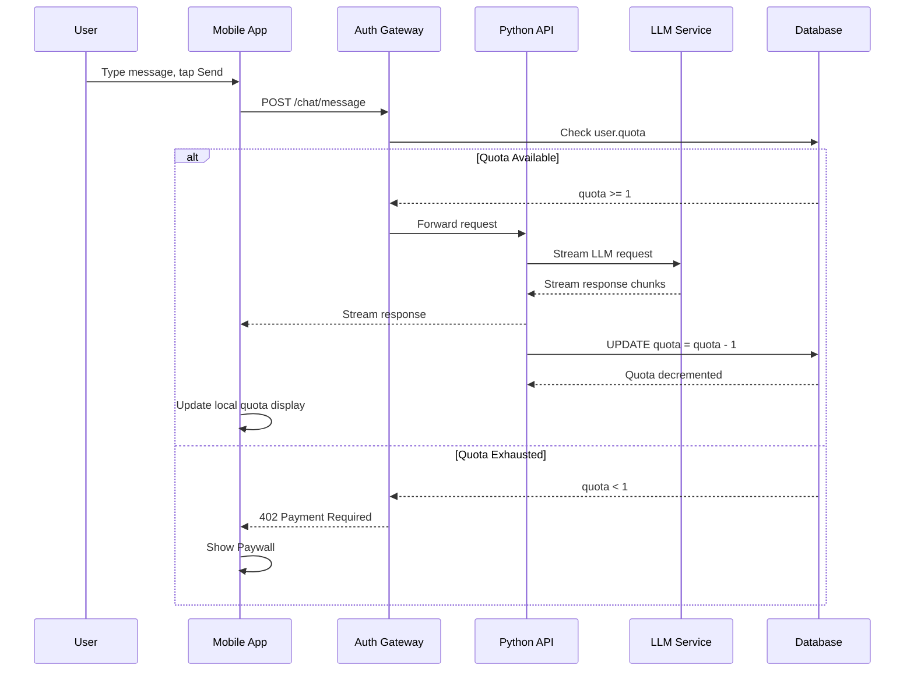

### Key Points
- **When decremented**: After successful LLM response (not on send)
- **Where checked**: Go Auth Gateway (before forwarding to API)
- **Error code**: HTTP 402 Payment Required

---

## 4. Paywall Trigger Flow

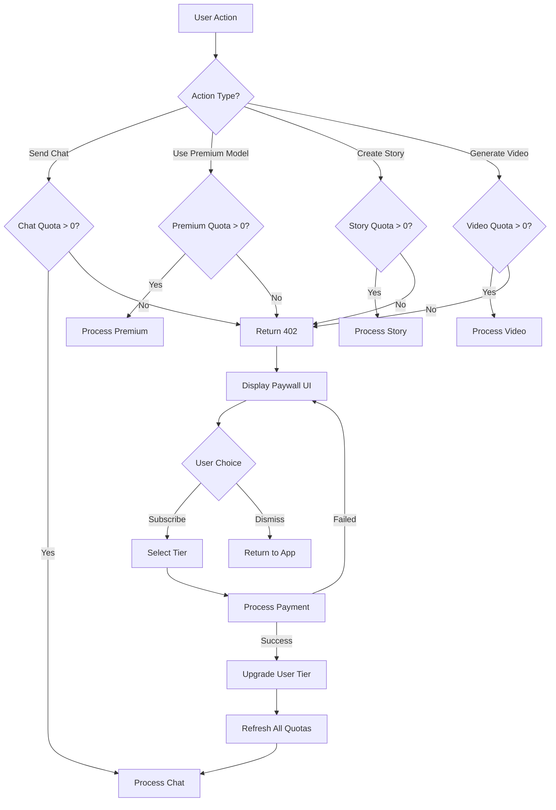

---

## 5. Daily Quota Replenishment

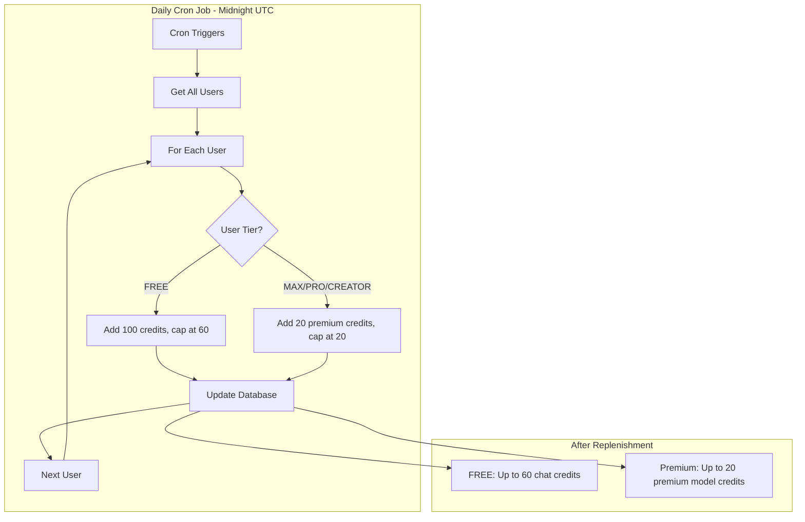

### Replenishment Rules

**How it works:** Daily task sets quota TO the cap if below it (doesn't add to existing).

| User Type | Quota Type | Daily Minimum | Behavior | Source |
|-----------|------------|---------------|----------|--------|
| FREE | Regular Chat | 60 | Set to 60 if below | `quotas_config.py:30` |
| FREE | Premium Model | 5 | Set to 5 if below | `quotas_config.py:49` |
| MAX | Premium Model | 20 | Set to 20 if below | `quotas_config.py:50` |
| PRO/CREATOR | Premium Model | - | Monthly only | `models.py:776-777` |

**Example:** FREE user with 30 credits → daily task → 60 credits (not 130)

---

## 6. Monthly Quota Reset

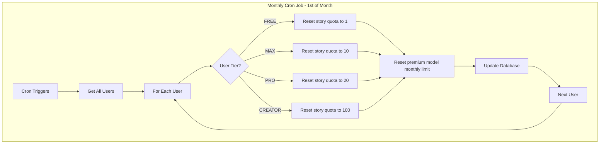

---

## 7. Premium Tier Pricing

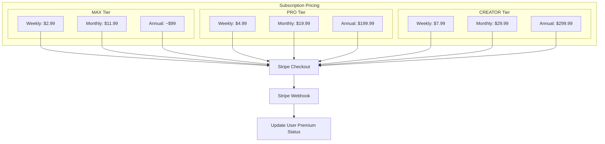

### Price Comparison

| Period | MAX | PRO | CREATOR |
|--------|-----|-----|---------|
| Weekly | $2.99 | $4.99 | $7.99 |
| Monthly | $11.99 | $19.99 | $29.99 |
| Annual | ~$99 | $199.99 | $299.99 |

---

## 8. Referral Bonus System

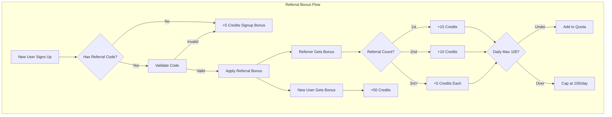

### Referral Bonuses

| Event | Credits |
|-------|---------|
| New user signup (no referral) | +5 |
| Referee bonus (used code) | +50 |
| Referrer 1st referral | +15 |
| Referrer 2nd referral | +10 |
| Referrer 3rd+ referrals | +5 each |
| Daily referral cap | 105 max |

---

## 9. Complete Message Lifecycle

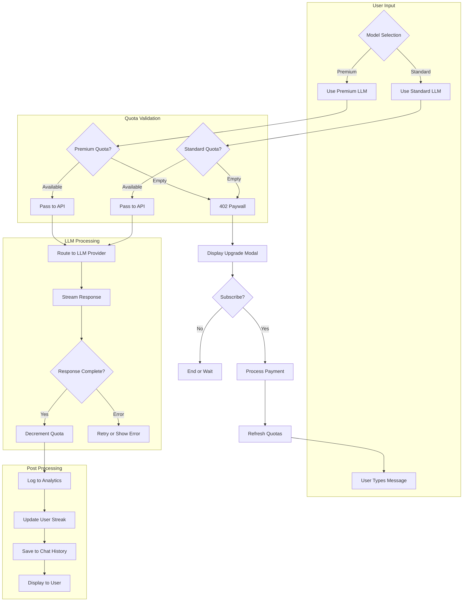

---

## Technical Implementation Notes

### Key Files

| Component | File Location |
|-----------|---------------|
| Quota Constants | `sceneXtras/api/model/quotas_config.py` |
| User Model | `sceneXtras/api/model/models.py` |
| Payment Router | `sceneXtras/api/router/payment_router.py` |
| Chat Router | `sceneXtras/api/router/gpt_chat_router.py` |
| Daily Cron | `sceneXtras/api/bash_scripts/run_daily_task.py` |
| Monthly Cron | `sceneXtras/api/bash_scripts/run_monthly_task.py` |
| Mobile Store | `mobile_app_sx/store/userStore.ts` |
| Paywall UI | `mobile_app_sx/app/subscription.tsx` |

### Quota Database Fields

```sql
-- User table quota fields
quota                   -- Regular chat credits
quota_video             -- Video generation
quota_premium_model     -- Premium LLM usage
quota_story             -- Story creation
quota_image_generation  -- Image generation
quota_image_recognition -- Image recognition
tokens_used             -- Total standard tokens consumed
premium_tokens_used     -- Total premium tokens consumed
```

### Caching Caveat

> **Important**: User quota values must be fetched fresh from DB on each request. Cached User objects become stale within seconds due to concurrent consumption. Only identity fields should be cached.

---

## Summary

The SceneXtras chat business model operates on:

1. **Tiered subscriptions** (FREE → MAX → PRO → CREATOR)
2. **Multiple quota types** (chat, premium, story, video, image)
3. **Daily replenishment** with tier-specific caps
4. **Monthly resets** for story and premium model limits
5. **402 Paywall triggers** when quotas exhausted
6. **Referral bonuses** for organic growth
7. **Stripe/RevenueCat** for payment processing
